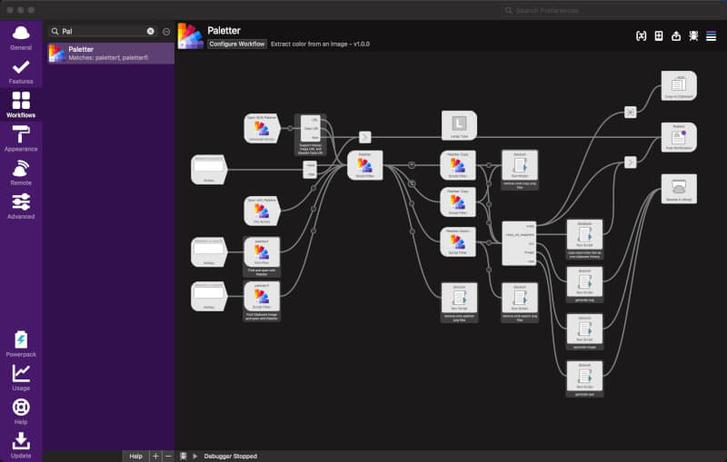

# alfred paletter

Extract color palette from an image

[](https://github.com/cage1016/alfred-paletter/actions/workflows/release.yml)
[](https://lbesson.mit-license.org/)

[](https://codecov.io/gh/cage1016/alfred-paletter)


## Features

- Dominates the color palette with k-means clustering
- support image format: `jpg`, `png`, `gif`, `bmp`, `webp` and `tiff`
- Local file / base64 image data URI / `http` and `https` image source URL
- Export palette
  - Code
  - CSS
  - ASE file
  - Image file: Support `RGB` ,`HEX` ,`CMYK` ,`HSL` ,`HSV` ,`HWB` ,`LAB` ,`XYZ` ,`HCG`
- Copy palette (`⌥ + Enter` Single / `^ + Enter` Multiple) to clipboard
  - `RGB` ,`HEX` ,`CMYK` ,`HSL` ,`HSV` ,`HWB` ,`LAB` ,`XYZ` ,`HCG`
  - Multiple palette mode copy color separated by (`⌥ + Enter`)

## Download
Make sure to download the latest released directly from the releases page. [Download here](https://github.com/cage1016/alfred-paletter/releases).

## Requires
- Preferably Alfred 5

## Configuration
- Number of colors to extract

## Usage



- File Filter / File Action 
- Hokey
- Universal Action with Base64 Image Data URI and image URL


### Copy Single Color


### Copy Multiple Colors


### Export Image Sample: Hex


### ASE sample Decode result

https://carl.camera/sandbox/aseconvert/


### Code Sample

```
/* CSV */
95d6fa, 65befa, 9facb5, 4186c1, 727953, 134571, 323e39

/* With # */
#95d6fa, #65befa, #9facb5, #4186c1, #727953, #134571, #323e39

/* Array */
["#95d6fa", "#65befa", "#9facb5", "#4186c1", "#727953", "#134571", "#323e39"]

/* Object */
{"Pale cyan":"#95d6fa", "Maya blue":"#65befa", "Cadet grey":"#9facb5", "Cyan-blue azure":"#4186c1", "Axolotl":"#727953", "Dark imperial blue":"#134571", "Black olive":"#323e39"}

/* Extended Array */
[ {"name": "Pale cyan","hex": "#95d6fa","rgb": [149, 214, 214],"cmyk": [40, 14, 0],"hsv": [201, 40, 98],"hsl": [201, 91, 78],"lab": [82, -10, -24],"hcg": [201, 40, 97],"hwb": [201, 58, 2],"xyz": [54, 61, 99]}  {"name": "Maya blue","hex": "#65befa","rgb": [101, 190, 190],"cmyk": [60, 24, 0],"hsv": [204, 60, 98],"hsl": [204, 94, 69],"lab": [74, -8, -38],"hcg": [204, 58, 95],"hwb": [204, 40, 2],"xyz": [41, 46, 97]}  {"name": "Cadet grey","hex": "#9facb5","rgb": [159, 172, 172],"cmyk": [12, 5, 0],"hsv": [205, 12, 71],"hsl": [205, 13, 67],"lab": [69, -3, -6],"hcg": [205, 9, 68],"hwb": [205, 62, 29],"xyz": [37, 40, 49]}  {"name": "Cyan-blue azure","hex": "#4186c1","rgb": [65, 134, 134],"cmyk": [66, 31, 0],"hsv": [208, 66, 76],"hsl": [208, 51, 51],"lab": [54, -4, -38],"hcg": [208, 50, 51],"hwb": [208, 25, 24],"xyz": [20, 22, 54]}  {"name": "Axolotl","hex": "#727953","rgb": [114, 121, 121],"cmyk": [6, 0, 31],"hsv": [71, 31, 47],"hsl": [71, 19, 40],"lab": [49, -12, 20],"hcg": [71, 15, 38],"hwb": [71, 33, 53],"xyz": [15, 18, 11]}  {"name": "Dark imperial blue","hex": "#134571","rgb": [19, 69, 69],"cmyk": [83, 39, 0],"hsv": [208, 83, 44],"hsl": [208, 71, 26],"lab": [29, -8, -27],"hcg": [208, 37, 12],"hwb": [208, 7, 56],"xyz": [5, 6, 16]}  {"name": "Black olive","hex": "#323e39","rgb": [50, 62, 62],"cmyk": [19, 0, 8],"hsv": [155, 19, 24],"hsl": [155, 11, 22],"lab": [24, 3, -3],"hcg": [155, 5, 21],"hwb": [155, 20, 76],"xyz": [4, 4, 5]} ]

/* XML */
<palette>
 <color name="Pale cyan" hex="#95d6fa" r="149" g="214" b="250" /> 
 <color name="Maya blue" hex="#65befa" r="101" g="190" b="250" /> 
 <color name="Cadet grey" hex="#9facb5" r="159" g="172" b="181" /> 
 <color name="Cyan-blue azure" hex="#4186c1" r="65" g="134" b="193" /> 
 <color name="Axolotl" hex="#727953" r="114" g="121" b="83" /> 
 <color name="Dark imperial blue" hex="#134571" r="19" g="69" b="113" /> 
 <color name="Black olive" hex="#323e39" r="50" g="62" b="57" /> 
</palette>
```

## CSS Sample

```css
/* CSS HEX */
--pale-cyan: #95d6faff;
--maya-blue: #65befaff;
--cadet-grey: #9facb5ff;
--cyan-blue-azure: #4186c1ff;
--axolotl: #727953ff;
--dark-imperial-blue: #134571ff;
--black-olive: #323e39ff

/* CSS HSL */
--pale-cyan: hsla(201, 91%, 78%, 1);
--maya-blue: hsla(204, 94%, 69%, 1);
--cadet-grey: hsla(205, 13%, 67%, 1);
--cyan-blue-azure: hsla(208, 51%, 51%, 1);
--axolotl: hsla(71, 19%, 40%, 1);
--dark-imperial-blue: hsla(208, 71%, 26%, 1);
--black-olive: hsla(155, 11%, 22%, 1)

/* SCSS HEX */
$pale-cyan: #95d6faff;
$maya-blue: #65befaff;
$cadet-grey: #9facb5ff;
$cyan-blue-azure: #4186c1ff;
$axolotl: #727953ff;
$dark-imperial-blue: #134571ff;
$black-olive: #323e39ff

/* SCSS HSL */
$pale-cyan: hsla(201, 91%, 78%, 1);
$maya-blue: hsla(204, 94%, 69%, 1);
$cadet-grey: hsla(205, 13%, 67%, 1);
$cyan-blue-azure: hsla(208, 51%, 51%, 1);
$axolotl: hsla(71, 19%, 40%, 1);
$dark-imperial-blue: hsla(208, 71%, 26%, 1);
$black-olive: hsla(155, 11%, 22%, 1)

/* SCSS RGB */
$pale-cyan: rgba(149, 214, 250, 1);
$maya-blue: rgba(101, 190, 250, 1);
$cadet-grey: rgba(159, 172, 181, 1);
$cyan-blue-azure: rgba(65, 134, 193, 1);
$axolotl: rgba(114, 121, 83, 1);
$dark-imperial-blue: rgba(19, 69, 113, 1);
$black-olive: rgba(50, 62, 57, 1)

/* SCSS Gradient */
$gradient-top: linear-gradient(0deg, #95d6faff, #65befaff, #9facb5ff, #4186c1ff, #727953ff, #134571ff, #323e39ff);
$gradient-right: linear-gradient(90deg, #95d6faff, #65befaff, #9facb5ff, #4186c1ff, #727953ff, #134571ff, #323e39ff);
$gradient-bottom: linear-gradient(180deg, #95d6faff, #65befaff, #9facb5ff, #4186c1ff, #727953ff, #134571ff, #323e39ff);
$gradient-left: linear-gradient(270deg, #95d6faff, #65befaff, #9facb5ff, #4186c1ff, #727953ff, #134571ff, #323e39ff);
$gradient-top-right: linear-gradient(45deg, #95d6faff, #65befaff, #9facb5ff, #4186c1ff, #727953ff, #134571ff, #323e39ff);
$gradient-bottom-right: linear-gradient(135deg, #95d6faff, #65befaff, #9facb5ff, #4186c1ff, #727953ff, #134571ff, #323e39ff);
$gradient-top-left: linear-gradient(225deg, #95d6faff, #65befaff, #9facb5ff, #4186c1ff, #727953ff, #134571ff, #323e39ff);
$gradient-bottom-left: linear-gradient(315deg, #95d6faff, #65befaff, #9facb5ff, #4186c1ff, #727953ff, #134571ff, #323e39ff);
$gradient-radial: radial-gradient(#95d6faff, #65befaff, #9facb5ff, #4186c1ff, #727953ff, #134571ff, #323e39ff);
```

## Third Party Library

- [Baldomo/paletter: CLI app and library to extract a color palette from an image through clustering](https://github.com/Baldomo/paletter)

## Change Log

### 1.0.0
- add export features (Code / CSS / ASE / Image with `RGB` ,`HEX` ,`CMYK` ,`HSL` ,`HSV` ,`HWB` ,`LAB` ,`XYZ` ,`HCG`) 
- revised copy feature as single / multiple palette

### 0.2.1
- revised README and new demo.gif for better user experience

### 0.2.0
- add `bmp`, `webp` and `tiff` support
- add dynamic color number setup by ` +number` ex: `paletter file-path +10`
- revised items wording

### 0.1.0
- Initial release

## License
This project is licensed under the MIT License. See [LICENSE](LICENSE) for details.